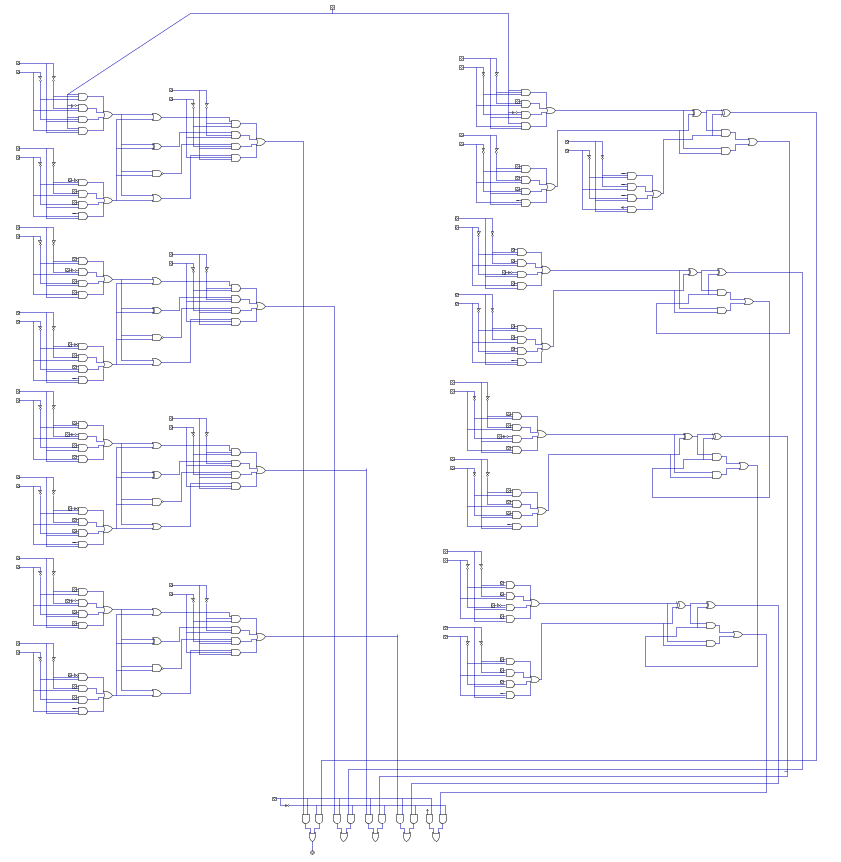

# 4-Bit Gate-Level ALU Design

## Overview

This design presents an 4-bit Arithmetic Logic Unit (ALU) implemented at gate level using basic logic gates.

The design includes both arithmetic and logical operations selected through control inputs. A Verilog implementation and a separate testbench are also included for functional verification.

The ALU can be used as one of the main processing units in the design of a basic computer architecture.

## Supported Operations

### Logic Operations

- A OR B̅
- A̅ XOR B
- A NAND B
- Transfer A

### Arithmetic Operations

- A + B
- B + B
- B - A - 1
- A + 1

## Features

- 4-bit ALU architecture
- Gate-level implementation
- Basic logic gate design
- Arithmetic operations
- Logical operations
- Control-based operation selection
- Verilog HDL implementation
- Testbench verification
- Digital circuit simulation
- Suitable for basic computer architecture

## Implementation

The circuit is designed at gate level using basic digital logic components.

A Verilog HDL version of the ALU is also included along with a testbench for verifying the supported operations and checking the behavior of the design under different input combinations.

## Tools

- Digital Logic Simulator
- Verilog HDL

## Repository Structure

- `Digital` - Digital circuit design file
- `Verilog` - Verilog source code and testbench

## Design Preview

